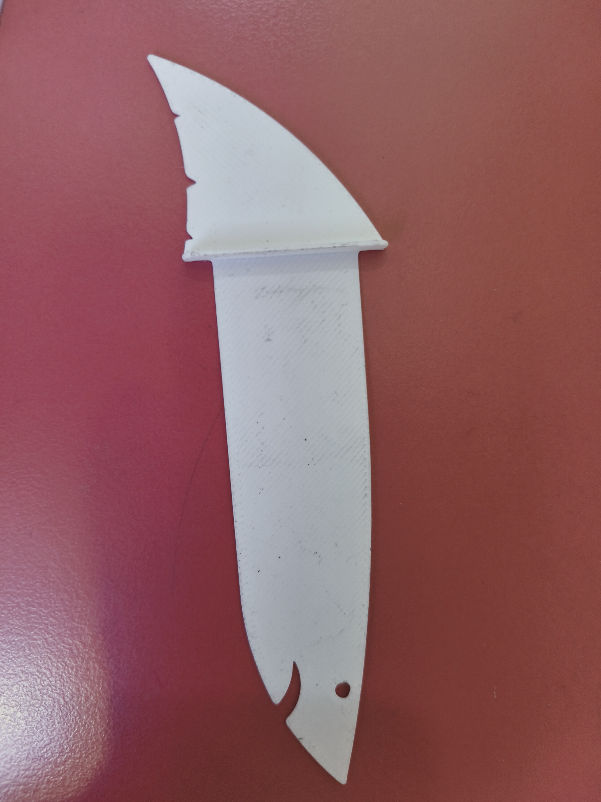

# Task 1: 3D Printing & Thin-Film Geometry Calibration

---

### 1. Objective
To master the **FDM (Fused Deposition Modeling)** workflow by printing a **Shark Bookmark** (`bookshark.stl`). This project serves as a critical test for the printer’s ability to handle very thin layers and maintain a perfectly flat profile without warping.

---

### 2. The Model: Shark Bookmark
* **Design:** A functional, low-profile bookmark featuring a shark silhouette. 
* **Challenge:** High susceptibility to **warping** (corners peeling up) as the plastic cools.

---

### 3. Slicing Parameters (Golden Settings)

| Parameter | Value | Reason |
| :--- | :--- | :--- |
| **Layer Height** | 0.2 mm | Standard balance; ensures the bookmark is thin but strong. |
| **Wall Line Count** | 3 | Strengthens the outer "skin" of the shark shape. |
| **Infill Density** | 100% | Since it is very thin, 100% infill makes it solid and durable. |
| **Print Speed** | 50 mm/s | Balanced speed for a smooth top-surface finish. |
| **Printing Temp** | 200°C | Optimal flow for PLA to ensure the layers bond perfectly. |
| **Build Plate Temp** | 60°C | Keeps the wide, flat base from peeling off the bed. |
| **Initial Layer Speed**| 15 mm/s | Extra slow start to guarantee the tail and fins stick perfectly. |

---

### 4. Technical Procedure & Hardware Mechanism

**A. The Hardware "Guts":**
The 3D printing process follows a specific mechanical path:
1. **Extruder:** Grips and pushes filament.
2. **Hot End:** Melts plastic (200°C).
3. **Nozzle:** 0.4mm tip for precision.
4. **Cooling Fan:** Hardens plastic instantly.

**B. Step-by-Step Workflow:**
* **File Preparation:** Imported `bookshark.stl` and rotated it to lay flat.
* **G-Code Generation:** Created layer-by-layer instructions.
* **Printer Setup:** Cleaned the build plate with **IPA** to prevent warping.
* **Execution:** Monitored for a "perfect squish" on the first layer.
