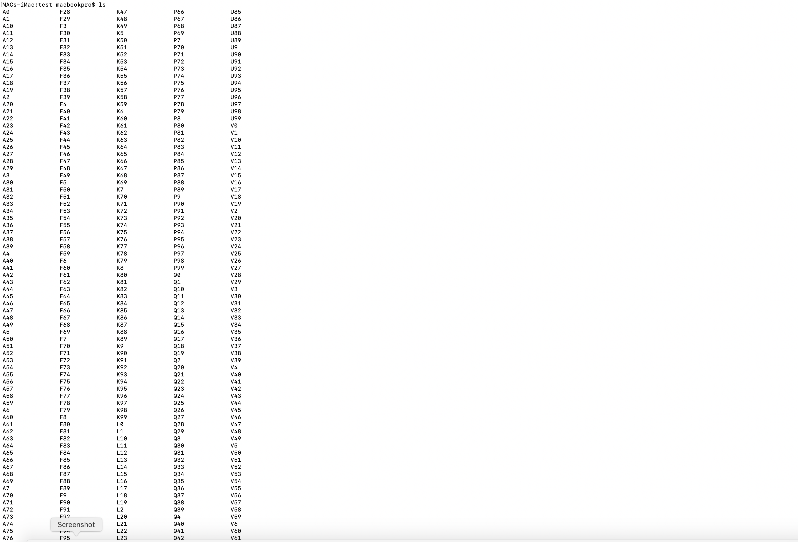
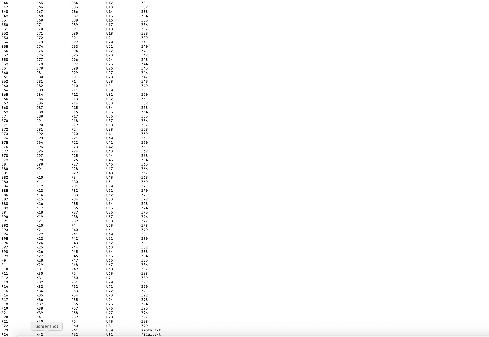

# Task 4: Linux & Ubuntu Command Line Mastery

---

### 1. Objective
To demonstrate proficiency in the Linux/Ubuntu terminal environment by executing file system operations, automation scripts, and file manipulation commands.

---

### 2. Step-by-Step Execution Proof

#### Step A: Directory & File Creation
*Creating the 'test' directory and generating an empty file using `touch`.*

#### Step B: Batch Folder Generation (2,600 Folders)
*Using Brace Expansion `{A..Z}{0..99}` to automate the creation of 2,600 directories instantly.*

#### Step C: Directory Verification
*Using the `ls` command to verify the successful creation of the indexed folders.*

#### Step D: File Concatenation
*Creating two separate text files and using `cat` to merge and display their contents.*

*(Optional) #### Step E: Final Workspace Overview*

---

### 3. Command Summary Table
| Action | Command |
| :--- | :--- |
| **Make Directory** | `mkdir test` |
| **Navigate** | `cd test` |
| **Blank File** | `touch empty.txt` |
| **Mass Folders** | `mkdir {A..Z}{0..99}` |
| **Combine Files** | `cat file1.txt file2.txt` |

---

### 4. Key Takeaways
* **Automation:** Learned that the CLI is significantly more powerful than a GUI for repetitive tasks like creating thousands of folders.
* **Bash Syntax:** Mastered the use of single quotes to escape special characters (like `!`) in the terminal.