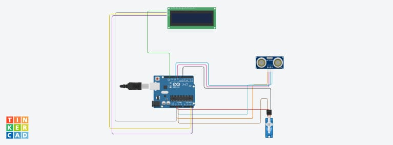

# Task 4: Ultrasonic Radar System with LCD Interface

---

### 1. Objective
To design and simulate a radar system that scans a 150-degree field of view using an Ultrasonic Sensor, a Servo Motor, and an I2C LCD for real-time data visualization.

### 2. Components Used
* **Arduino Uno:** The central microcontroller.
* **HC-SR04 Ultrasonic Sensor:** To measure distance using sound wave reflection.
* **Micro Servo Motor:** To rotate the sensor dynamically from 15° to 165°.
* **I2C LCD (16x2):** To display the current scanning angle and detected distance.

### 3. Circuit Implementation
The system uses the **LiquidCrystal_I2C** library to simplify the wiring of the display, requiring only two data pins (SDA and SCL) in addition to power. The Ultrasonic sensor is triggered via Pin 9, with the echo received on Pin 10.



---

### 4. Logic & Calculations
The distance is calculated based on the duration of the reflected sound pulse using the formula:
$$Distance = \frac{Duration \times 0.034}{2}$$

* **Sweep Range:** The servo is programmed to oscillate between 15° and 165° to ensure stable readings and protect the motor's physical limits.
* **Real-time Feedback:** Every 50ms, the LCD clears and updates with the latest coordinates of the obstacle.

### 5. Code Snippet (Logic Overview)
```cpp
void updateLCD(int angle, int distance) {
  lcd.clear();
  lcd.setCursor(0,0);
  lcd.print("Angle: ");
  lcd.print(angle);
  
  lcd.setCursor(0,1);
  lcd.print("Dist: ");
  lcd.print(distance);
  lcd.print("cm");
}