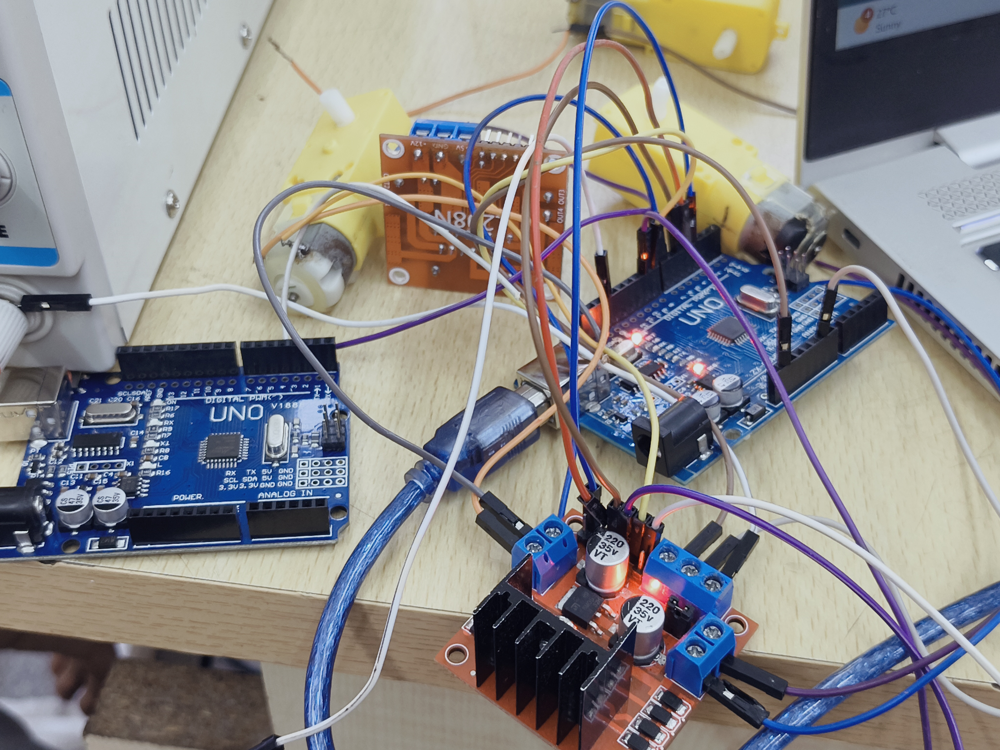

# Task 8: Speed Control of DC Motor using L298N & Arduino

---

### 1. Objective
To interface a DC BO (Battery Operated) motor with an Arduino Uno via an L298N Dual H-Bridge driver and implement speed control using Pulse Width Modulation (PWM).

### 2. Hardware Setup
As shown in the lab documentation, a regulated **DC Power Supply** was used to provide a stable **12V** input to the motor driver. This ensures consistent torque and protects the Arduino from high current draw.

* **Controller:** Arduino Uno
* **Driver:** L298N H-Bridge (with integrated heat sink for thermal management)
* **Actuator:** 5V-9V Yellow BO Motor
* **Power Source:** External DC Power Supply (Set to 12.0V)

### 3. Circuit Implementation
The L298N module acts as the power interface. The Arduino sends low-power logic signals to the driver's input pins, which then switches the high-power 12V supply to the motor.

---

### 4. Technical Concepts
* **PWM Speed Control:** By using the `analogWrite()` function on the Enable pin (ENA), we vary the duty cycle of the motor's power.
* **H-Bridge Logic:** By toggling IN1 and IN2 pins between HIGH and LOW, we can reverse the direction of the motor's rotation.
* **Common Ground:** The Ground (GND) of the DC Power Supply, L298N, and Arduino are all tied together to create a common reference point for signals.

### 5. Observations
The motor began rotating when the PWM value exceeded approximately 70. Full speed was achieved at a value of 255. The L298N remained cool during operation due to the efficient heat sink design.

---
