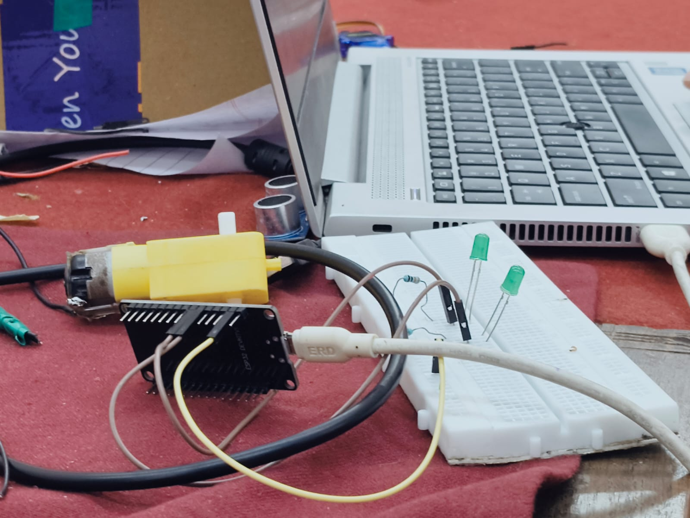

# Task 11: LED Toggle via ESP32 Web Server

---

### 1. Objective
To control an LED wirelessly from a phone or laptop. The ESP32 hosts a simple website; clicking buttons on the site sends a signal to the ESP32 to turn the LED on or off.

### 2. The Components (The Team)
* **ESP32:** The "brain" with built-in Wi-Fi. It runs the website.
* **LED:** The light we want to control (the "worker").
* **Resistor:** Limits electricity to protect the LED (the "safety").
* **USB Cable:** Provides power and uploads the code (the "umbilical cord").

---

### 3. Basic Connections (Where the Wires Go)
These connections complete the electrical circuit, allowing the ESP32 to send "HIGH" or "LOW" signals to the LED.

| Connection | Wires | Where they go |
| :--- | :--- | :--- |
| **Signal (ON/OFF)** | Brown Wires | ESP32 GPIO 2 $\rightarrow$ LED Long Leg |
| **Return Path (GND)**| Yellow Wire | ESP32 GND $\rightarrow$ Breadboard $\rightarrow$ LED Short Leg |
| **Protection** | Resistor | Between LED and wires (prevents burnout) |

---

### 4. Lab Setup Visualization
Below are images showing the physical setup from the lab, as referenced in the discussion.

*Figure 1: Overall view of the ESP32, breadboard, LEDs, and connection to the laptop.*

---

### 5. How it Works (The Main Gist)
1. **The Handshake:** The ESP32 connects to the Wi-Fi. It is assigned a unique number called an **IP Address**.
2. **The Server:** The ESP32 hosts a tiny web page. Typing the **IP Address** into a phone's browser shows "ON" and "OFF" buttons.
3. **The Trigger:** Clicking a button sends a request. The ESP32 receives it and sends electricity (HIGH signal) to **GPIO Pin 2**, lighting the LED.

### 6. Senior Summary (What to Say)
> "In Task 11, I built a wireless light switch. I programmed the ESP32 to connect to my Wi-Fi and host a simple website. When I clicked the buttons on my phone screen, the ESP32 received the command and toggled the **GPIO Pin 2** (the signal pin) and used the **GND** (yellow wire) for the return path to successfully turn the LED on or off."

---
*Submitted by: Anvita Pranjal | UVCE ECE 2nd Sem*