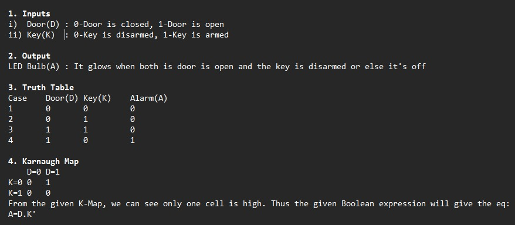
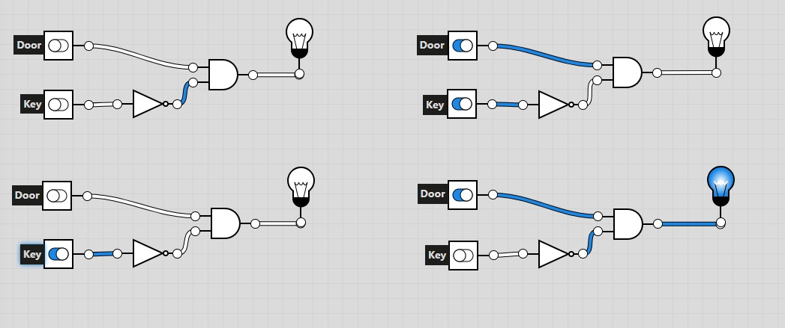

#  Task 14: Burglar Alarm System via K-Map & Logic Gates

---

### 1.  Objective
The core objective of this task was to design a functional **Burglar Alarm System** by applying Boolean algebra and **Karnaugh Map (K-Map)** optimization. The goal was to derive the simplest logic circuit that triggers an alarm only during unauthorized entry.

---

### 2.  Logic Mapping & Optimization

The system logic is based on two binary inputs:
* **D (Door):** 0 = Closed, 1 = Open
* **K (Key):** 0 = Disarmed (Not Pressed), 1 = Armed (Pressed)

#### **Truth Table**
| Case | Door (D) | Key (K) | Alarm (A) | Condition |
| :--- | :---: | :---: | :---: | :--- |
| 1 | 0 | 0 | 0 | Door Closed, No Key (Safe) |
| 2 | 0 | 1 | 0 | Door Closed, Key Pressed (Safe) |
| 3 | 1 | 1 | 0 | Door Open, Key Pressed (Authorized) |
| 4 | **1** | **0** | **1** | **Door Open, No Key (ALARM)** |

#### **K-Map Optimization**
By plotting the Truth Table into a 2-variable K-Map, we identify the single cell where the output is HIGH ($D=1, K=0$).

**Final Boolean Expression:** $$A = D \cdot \overline{K}$$

---

### 3.  Logic.ly Simulation
The circuit was simulated in **Logic.ly** to verify the mathematical model. The design uses a **NOT Gate** to invert the Key signal and an **AND Gate** to process the alarm condition.

**Simulation Observations:**
* **Authorized Entry:** When Door is ON and Key is ON, the AND gate receives (1, 0), so the Alarm remains **OFF**.
* **Security Breach:** When Door is ON and Key is OFF, the AND gate receives (1, 1), and the **LED glows**.

---

### 4. ✅ Technical Skills Gained
* **Combinational Logic:** Implementing real-world constraints using **AND** and **NOT** gates.
* **Circuit Optimization:** Using K-Maps to ensure the design uses the minimum number of gates possible.
* **Simulation Testing:** Validating theoretical Boolean expressions through digital software before hardware implementation.
