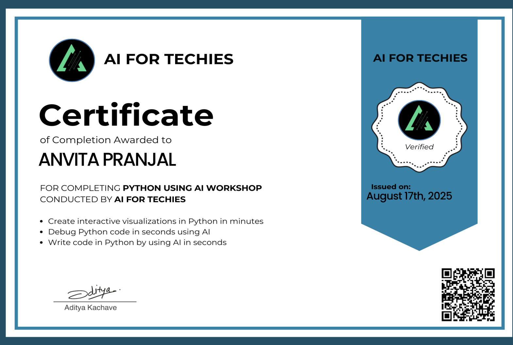

# Task 15: Technical Participation & Continued Learning

---

### 1. Objective
To demonstrate a commitment to lifelong learning and professional growth by completing specialized technical workshops and earning industry-recognized certifications.

---

### 2. MOOC / Workshop Completion: Python Using AI
I successfully completed a professional workshop focused on leveraging Artificial Intelligence to enhance programming productivity and data visualization.

* [cite_start]**Organization:** AI FOR TECHIES [cite: 1, 6]
* [cite_start]**Course Title:** Python Using AI Workshop [cite: 6]
* [cite_start]**Completion Date:** August 17th, 2025 [cite: 13]
* [cite_start]**Verification:** Verified Certificate issued by Aditya Kachave [cite: 11, 15]

**Key Skills Mastered:**
* [cite_start]**AI-Driven Coding:** Learning to write Python code efficiently using AI tools[cite: 9].
* [cite_start]**Automated Debugging:** Utilizing AI to identify and fix code errors in seconds[cite: 8].
* [cite_start]**Data Visualization:** Creating interactive and insightful visualizations in Python[cite: 7].

---

### 3. Impact on Engineering Studies
This certification bridges the gap between traditional electronics and modern computing. Understanding how to use AI for Python allows me to:
1.  Automate data analysis for lab experiments.
2.  Rapidly prototype software for embedded systems like the ESP32.
3.  Debug complex engineering algorithms with higher precision.

---

### 4. Evidence of Participation
Below is the verified certificate of completion awarded for this technical achievement.

---
